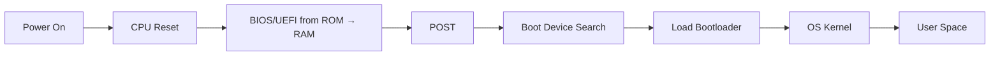

# 🖥️ How a Computer Starts Up

> *From silicon to software: The journey of a billion transistors waking up.*

```text
  _    _      _ _         __          __        _     _ 
 | |  | |    | | |        \ \        / /       | |   | |
 | |__| | ___| | | ___     \ \  /\  / /__  _ __| | __| |
 |  __  |/ _ \ | |/ _ \     \ \/  \/ / _ \| '__| |/ _` |
 | |  | |  __/ | | (_) |     \  /\  / (_) | |  | | (_| |
 |_|  |_|\___|_|_|\___/       \/  \/ \___/|_|  |_|\__,_|
                                                        
          BIOS → POST → Bootloader → OS → You
```

---

## 🚀 The Boot Sequence

### 1. **Power On**
When you press the power button, electricity flows through the motherboard and the CPU resets to a known state.

### 2. **BIOS/UEFI Initialization**
The BIOS (Basic Input/Output System) or UEFI (Unified Extensible Firmware Interface) firmware is copied from a non-volatile ROM chip into volatile RAM at address `0xF0000`.



### 3. **POST (Power-On Self Test)** 🧪
The firmware performs critical hardware diagnostics:
- ✅ CPU registers verification
- ✅ RAM integrity check
- ✅ GPU initialization
- ✅ Peripheral detection (keyboard, storage, etc.)

### 4. **Boot Device Selection**
The firmware searches for a bootable device in the configured order (USB → HDD → Network → etc.).

### 5. **Handoff to OS**
The bootloader is loaded into memory at `0x7C00` (legacy) or via EFI partition, then the OS kernel takes control.

---

## 🔍 How BIOS Finds an OS

### 📀 Legacy Boot (BIOS/MBR)

```text
┌─────────────────────────────────────────────────────┐
│  SECTOR 0 (512 bytes) - Master Boot Record (MBR)   │
│  ┌───────────────────────────────────────────────┐  │
│  │  Boot Code (446 bytes)                       │  │
│  ├───────────────────────────────────────────────┤  │
│  │  Partition Table (64 bytes)                  │  │
│  ├───────────────────────────────────────────────┤  │
│  │  Signature: 0x55 0xAA (2 bytes) ← MAGIC!     │  │
│  └───────────────────────────────────────────────┘  │
└─────────────────────────────────────────────────────┘
```

**Process:**
1. BIOS loads the first 512-byte sector from each bootable device into memory at `0x7C00`
2. Checks for the **boot signature** `0xAA55` (little-endian: `0x55 0xAA`)
3. If valid, jumps to `0x7C00` and begins executing the bootloader code

### 🚀 UEFI Boot (Modern)

```text
┌─────────────────────────────────────────────────────┐
│           EFI System Partition (ESP)                │
│  FAT32 formatted, ~100-500 MB                       │
│  ┌───────────────────────────────────────────────┐  │
│  │  /EFI/                                        │  │
│  │  ├── /BOOT/                                   │  │
│  │  │   └── BOOTX64.EFI ← Default bootloader     │  │
│  │  ├── /Microsoft/                              │  │
│  │  │   └── /Boot/                               │  │
│  │  │       └── bootmgfw.efi                     │  │
│  │  └── /Ubuntu/                                 │  │
│  │      └── shimx64.efi                          │  │
│  └───────────────────────────────────────────────┘  │
└─────────────────────────────────────────────────────┘
```

**Process:**
1. UEFI firmware scans for an **EFI System Partition (ESP)** with FAT32 filesystem
2. Reads the **Boot Manager** entries from NVRAM
3. Loads the specified `.efi` executable (PE/COFF format)
4. OS must be compiled as an EFI application with proper headers

---

## 🧠 CPU Registers Overview

### Register Sizes

| Type | Width | Use Case |
|------|-------|----------|
| 8-bit | `AL`, `BL`, `CL`, `DL` | Byte operations, ASCII |
| 16-bit | `AX`, `BX`, `CX`, `DX` | Real mode, legacy code |
| 32-bit | `EAX`, `EBX`, `ECX`, `EDX` | Protected mode (x86) |
| 64-bit | `RAX`, `RBX`, `RCX`, `RDX` | Long mode (x86-64) |
| 80-bit | `ST0-ST7` | x87 FPU registers |
| 128-bit | `XMM0-XMM15` | SSE/AVX vector operations |
| 256-bit | `YMM0-YMM15` | AVX2 vector operations |
| 512-bit | `ZMM0-ZMM31` | AVX-512 vector operations |

### General Purpose Registers (64-bit)

| Register | Name | Primary Purpose |
|----------|------|-----------------|
| `RAX` | Accumulator | Arithmetic, I/O, syscall return value |
| `RBX` | Base | Data pointer, preserved across calls |
| `RCX` | Counter | Loop counter, shift/rotate operations |
| `RDX` | Data | I/O, arithmetic (high part of 128-bit results) |
| `RSI` | Source Index | String/memory copy source |
| `RDI` | Destination Index | String/memory copy destination |
| `RBP` | Base Pointer | Stack frame base |
| `RSP` | Stack Pointer | Top of stack |
| `R8-R15` | Extended | Additional general-purpose registers |

### Status Flags (RFLAGS)

```text
  63                                                        0
┌───────────────────────────────────────────────────────────┐
│  Reserved  │  Flags: OF DF IF TF SF ZF AF PF CF           │
└───────────────────────────────────────────────────────────┘
```

| Flag | Name | Description |
|------|------|-------------|
| `CF` | Carry Flag | Carry/borrow from MSB (unsigned overflow) |
| `PF` | Parity Flag | Even number of 1-bits in result |
| `AF` | Adjust Flag | Carry from bit 3 (BCD arithmetic) |
| `ZF` | Zero Flag | Result is zero |
| `SF` | Sign Flag | MSB of result (negative if set) |
| `TF` | Trap Flag | Single-step debugging |
| `IF` | Interrupt Flag | Enable/disable maskable interrupts |
| `DF` | Direction Flag | String operation direction (↑/↓) |
| `OF` | Overflow Flag | Signed arithmetic overflow |

### Segment Registers (x86-64 Long Mode)

In 64-bit mode, segmentation is **mostly disabled** for a flat memory model:

| Register | Status in 64-bit Mode |
|----------|----------------------|
| `CS` | Base = 0, used for privilege level (CPL) |
| `DS`, `ES`, `SS` | Base = 0, limits ignored |
| `FS`, `GS` | **Active!** Can have non-zero base (TLS, per-CPU data) |
| `SS` | Stack segment, base = 0 |

> 💡 **FS/GS Usage**: Modern OSes use `FS` (Linux) or `GS` (Windows) for thread-local storage and kernel data structures.

---

## 📍 Memory Addressing

### Effective Address Calculation

```assembly
segment:[base + index*scale + displacement]

; Example:
mov rax, [rbx + rsi*4 + 0x10]  ; Access array element
```

**Components:**
- **Base**: Starting address (any GP register)
- **Index**: Array index (any GP register except RSP)
- **Scale**: Multiplier (1, 2, 4, or 8)
- **Displacement**: Constant offset (1, 2, or 4 bytes)

---

## 📚 The Stack

> *"Last In, First Out" (LIFO) memory structure*

```text
  High Addresses
       │
       ▼
  ┌─────────────┐
  │   Local     │ ← RBP (Base Pointer)
  │  Variables  │
  ├─────────────┤
  │  Previous   │
  │  RBP value  │
  ├─────────────┤
  │  Return     │
  │  Address    │
  ├─────────────┤
  │  Function   │
  │  Arguments  │
  │     ...     │
  ├─────────────┤ ← RSP (Stack Pointer) grows ↓
  │   Free      │
  │   Space     │
  ▼
  Low Addresses
```

**Operations:**
- `PUSH`: Decrement RSP, store value
- `POP`: Load value, increment RSP
- `CALL`: Push return address, jump
- `RET`: Pop return address, jump

---

## 📖 Further Reading

- 📘 [x86 Memory Architecture (NTU)](https://www.csie.ntu.edu.tw/~cyy/courses/assembly/12fall/lectures/handouts/lec12_x86arch.pdf) - Yung-Yu Chuang
- 📗 [Intel® 64 and IA-32 Architectures Software Developer's Manual](https://cdrdv2.intel.com/v1/dl/getContent/671200) - Official documentation
- 📙 [Stack-based Memory Allocation](https://en.wikipedia.org/wiki/Stack-based_memory_allocation) - Wikipedia

---

<div align="center">

**Made with** ⚡ **and curiosity about how machines think**

*Understanding the boot process is the first step to mastering systems programming.*

</div>